# [📈 Live Status](https://up.zhr.one): <!--live status--> **🟧 Partial outage**

This repository contains the open-source uptime monitor and status page for [Vlad Zaharia](http://vladzaharia.com), powered by [Upptime](https://github.com/upptime/upptime).

With [Upptime](https://upptime.js.org), you can get your own unlimited and free uptime monitor and status page, powered entirely by a GitHub repository. We use [Issues](https://github.com/vladzaharia/uptime/issues) as incident reports, [Actions](https://github.com/vladzaharia/uptime/actions) as uptime monitors, and [Pages](https://up.zhr.one) for the status page.

<!--start: status pages-->
<!-- This summary is generated by Upptime (https://github.com/upptime/upptime) -->
<!-- Do not edit this manually, your changes will be overwritten -->
<!-- prettier-ignore -->
| URL | Status | History | Response Time | Uptime |
| --- | ------ | ------- | ------------- | ------ |
|  [vlad.gg](https://vlad.gg) | 🟩 Up | [vlad-gg.yml](https://github.com/vladzaharia/uptime/commits/HEAD/history/vlad-gg.yml) | 

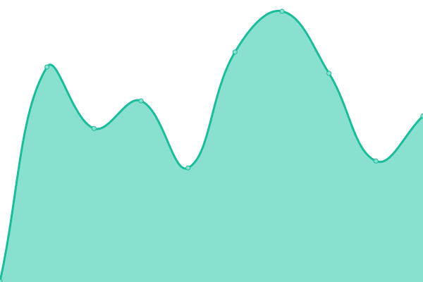 136ms
     
 | 

<a href="https://up.zhr.one/history/vlad-gg">100.00%</a>
    

|  [Dashboard](https://dash.zhr.one) | 🟩 Up | [dashboard.yml](https://github.com/vladzaharia/uptime/commits/HEAD/history/dashboard.yml) | 

 1555ms
     
 | 

<a href="https://up.zhr.one/history/dashboard">100.00%</a>
    

|  [Asset Tracking](https://asset.zhr.one) | 🟩 Up | [asset-tracking.yml](https://github.com/vladzaharia/uptime/commits/HEAD/history/asset-tracking.yml) | 

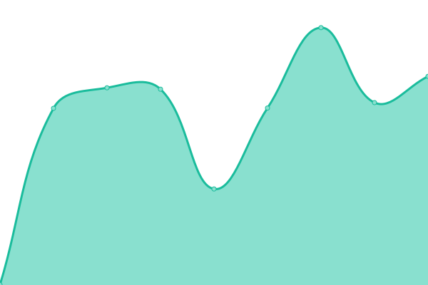 915ms
     
 | 

<a href="https://up.zhr.one/history/asset-tracking">100.00%</a>
    

|  [ZeroTier](https://network.zhr.one) | 🟩 Up | [zero-tier.yml](https://github.com/vladzaharia/uptime/commits/HEAD/history/zero-tier.yml) | 

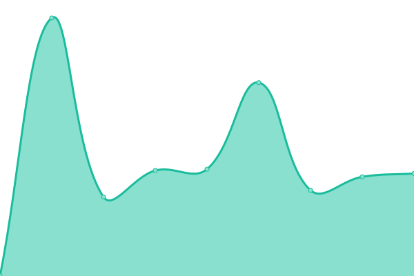 669ms
     
 | 

<a href="https://up.zhr.one/history/zero-tier">100.00%</a>
    

|  [Subspace](https://vpn.zhr.one) | 🟩 Up | [subspace.yml](https://github.com/vladzaharia/uptime/commits/HEAD/history/subspace.yml) | 

 381ms
     
 | 

<a href="https://up.zhr.one/history/subspace">100.00%</a>
    

|  [Mattermost](https://chat.zhr.one) | 🟩 Up | [mattermost.yml](https://github.com/vladzaharia/uptime/commits/HEAD/history/mattermost.yml) | 

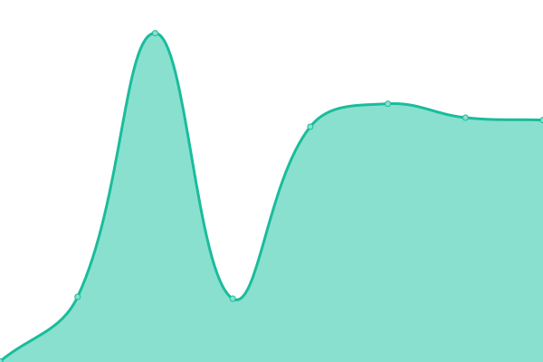 410ms
     
 | 

<a href="https://up.zhr.one/history/mattermost">100.00%</a>
    

|  [Murmur](mrmr.zhr.one:64738) | 🟩 Up | [murmur.yml](https://github.com/vladzaharia/uptime/commits/HEAD/history/murmur.yml) | 

 0ms
     
 | 

<a href="https://up.zhr.one/history/murmur">100.00%</a>
    

|  [Calibri](https://books.zhr.one) | 🟥 Down | [calibri.yml](https://github.com/vladzaharia/uptime/commits/HEAD/history/calibri.yml) | 

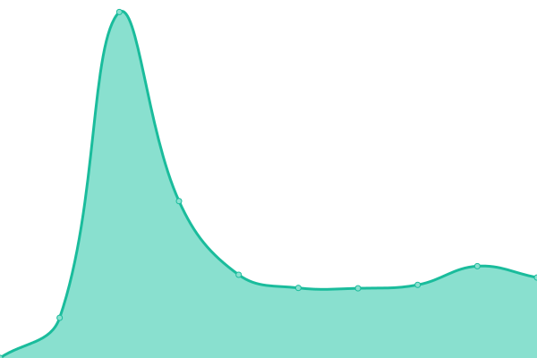 0ms
     
 | 

<a href="https://up.zhr.one/history/calibri">100.00%</a>
    

|  [Ferdi](https://ferdi.zhr.one) | 🟥 Down | [ferdi.yml](https://github.com/vladzaharia/uptime/commits/HEAD/history/ferdi.yml) | 

 0ms
     
 | 

<a href="https://up.zhr.one/history/ferdi">100.00%</a>
    

|  [Sonarr](https://sonarr.zhr.one) | 🟥 Down | [sonarr.yml](https://github.com/vladzaharia/uptime/commits/HEAD/history/sonarr.yml) | 

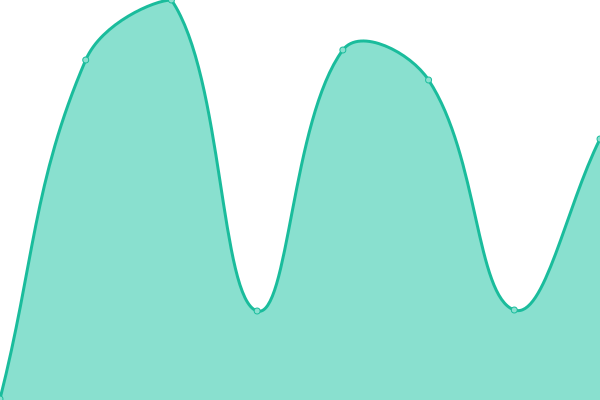 0ms
     
 | 

<a href="https://up.zhr.one/history/sonarr">100.00%</a>
    

|  [Radarr](https://radarr.zhr.one) | 🟥 Down | [radarr.yml](https://github.com/vladzaharia/uptime/commits/HEAD/history/radarr.yml) | 

 0ms
     
 | 

<a href="https://up.zhr.one/history/radarr">100.00%</a>
    

|  [Ombi](https://ombi.zhr.one) | 🟥 Down | [ombi.yml](https://github.com/vladzaharia/uptime/commits/HEAD/history/ombi.yml) | 

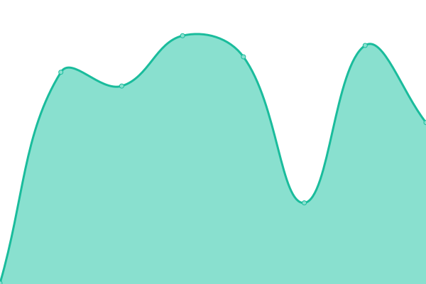 0ms
     
 | 

<a href="https://up.zhr.one/history/ombi">100.00%</a>
    

|  TeslaMate | 🟥 Down | [tesla-mate.yml](https://github.com/vladzaharia/uptime/commits/HEAD/history/tesla-mate.yml) | 

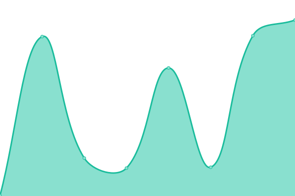 0ms
     
 | 

<a href="https://up.zhr.one/history/tesla-mate">100.00%</a>
    

|  TeslaMate Grafana | 🟥 Down | [tesla-mate-grafana.yml](https://github.com/vladzaharia/uptime/commits/HEAD/history/tesla-mate-grafana.yml) | 

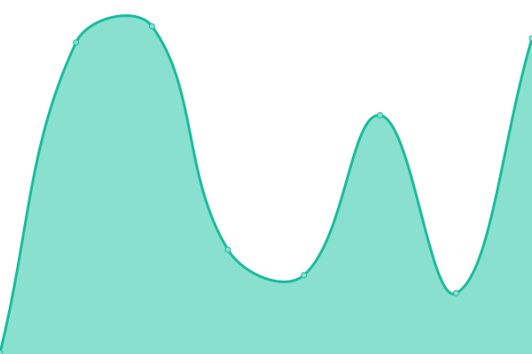 0ms
     
 | 

<a href="https://up.zhr.one/history/tesla-mate-grafana">100.00%</a>
    

|  [GGStream](https://ggstream.app) | 🟩 Up | [gg-stream.yml](https://github.com/vladzaharia/uptime/commits/HEAD/history/gg-stream.yml) | 

 803ms
     
 | 

<a href="https://up.zhr.one/history/gg-stream">100.00%</a>
    

|  [GGStream Ingest](svc-sea.ggstream.app:1935) | 🟩 Up | [gg-stream-ingest.yml](https://github.com/vladzaharia/uptime/commits/HEAD/history/gg-stream-ingest.yml) | 

 0ms
     
 | 

<a href="https://up.zhr.one/history/gg-stream-ingest">100.00%</a>
    

|  [The Mix Site](https://www.themixowners.com) | 🟩 Up | [the-mix-site.yml](https://github.com/vladzaharia/uptime/commits/HEAD/history/the-mix-site.yml) | 

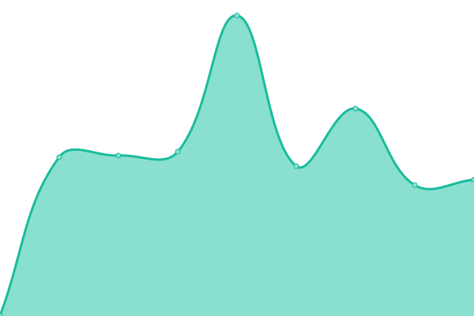 802ms
     
 | 

<a href="https://up.zhr.one/history/the-mix-site">100.00%</a>
    

|  [The Mix Invoicing](https://invoice.themixowners.com) | 🟩 Up | [the-mix-invoicing.yml](https://github.com/vladzaharia/uptime/commits/HEAD/history/the-mix-invoicing.yml) | 

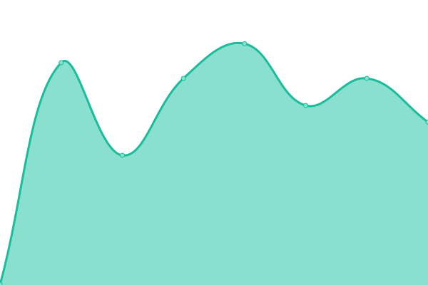 611ms
     
 | 

<a href="https://up.zhr.one/history/the-mix-invoicing">100.00%</a>
    

<!--end: status pages-->

[**Visit our status website →**](https://up.zhr.one)

## 📄 License

- Powered by: [Upptime](https://github.com/upptime/upptime)
- Code: [MIT](./LICENSE) © [Vlad Zaharia](http://vladzaharia.com)
- Data in the `./history` directory: [Open Database License](https://opendatacommons.org/licenses/odbl/1-0/)
